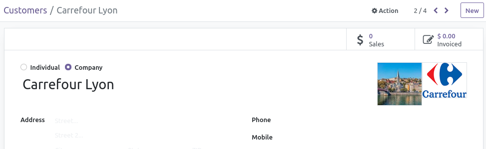
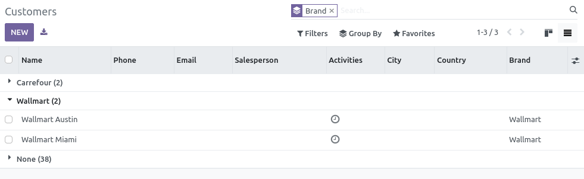
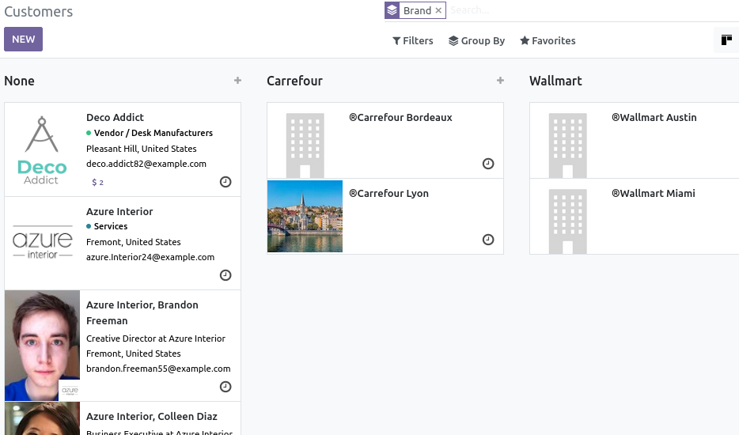

Allow to set brand to partners allowing to group/filter partners by brand

A brand, here, could be Carrefour, Wallmart, etc.

It also display brand image in form view and flag for partner with brand in kanban

